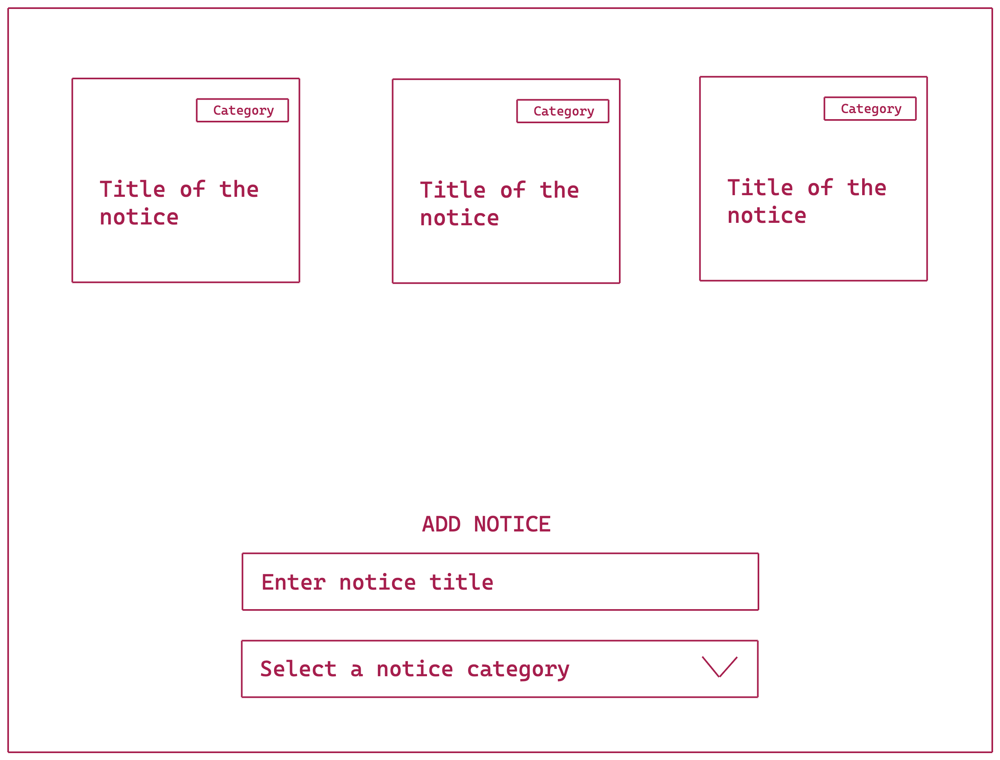

## Notice Board

- Create a notice board
- Using input box and title you can add a new notice
- While adding a notice you will also choose a category
- Once the notice is added it will be visible on the top
- Using double click on the title or the category will allow the user to edit the text.
- When you click outside (blur) of the respective element or press enter the title or category will get updated to the new value.
- Add local storage support

## Demo

