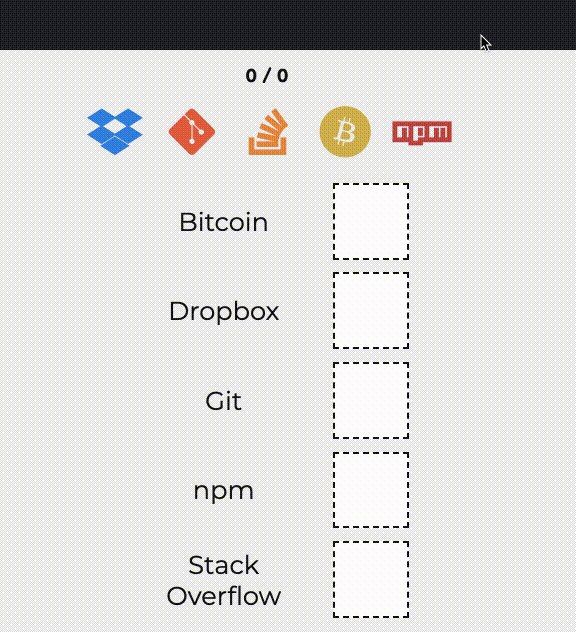

## Drag and Drop Game

- It will contain a collection of icons (you can use font awesome)
- From the collection randomly choose 5 icons and display
- Based on the icons there will be text representing the icon
- Next to the text will be a empty box
- You have to drag the icon and drop in the box
- If you are dragging at the right box it will get settled
- If the box is not right it will bounce back to the place
- Look at the demo to understand it better

## DEMO

